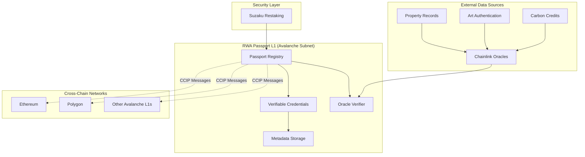

# 🌐 Cross-Chain RWA Passport

**Verifiable Credentials for Real-World Assets on Avalanche**

> *Enabling trusted, interoperable, and verifiable Real-World Asset (RWA) metadata across blockchain networks*

[]() 
[]() 
[]()

## 🎯 Problem Statement

The tokenized Real-World Asset (RWA) market represents a **$4.5 trillion opportunity**, but faces critical challenges:

- **❌ Fragmented Metadata**: RWA information is siloed across different blockchains
- **❌ Verification Bottlenecks**: No standardized way to verify asset authenticity cross-chain
- **❌ Trust Issues**: Limited provenance tracking leads to fraud and counterfeiting
- **❌ Liquidity Constraints**: Assets can't move freely between ecosystems due to metadata dependencies

## 💡 Solution Overview

**Cross-Chain RWA Passport** creates a universal identity system for Real-World Assets, enabling:

✅ **Verifiable Credentials**: Immutable asset metadata and provenance records  
✅ **Cross-Chain Portability**: Asset information travels with tokens via Chainlink CCIP  
✅ **Oracle Integration**: Real-world data verified through Chainlink oracles  
✅ **Security First**: Infrastructure secured by Suzaku's restaking protocol  

## 🏗️ Architecture



## 🚀 Key Features

### 🔐 Verifiable Passport System
- **Digital Identity**: Each RWA gets a unique, immutable passport
- **Rich Metadata**: Property deeds, authenticity certificates, compliance records
- **Provenance Tracking**: Complete ownership and transaction history

### 🌉 Cross-Chain Compatibility  
- **CCIP Integration**: Seamless passport data transmission across chains
- **Universal Recognition**: Any CCIP-supported network can verify asset authenticity
- **Automated Bridging**: Passport data travels automatically with asset transfers

### 📊 Oracle-Verified Data
- **Real-World Integration**: Chainlink oracles bring external attestations on-chain
- **Multi-Source Verification**: Aggregate data from multiple trusted sources
- **Dynamic Updates**: Real-time updates for changing asset conditions

### 🛡️ Enterprise Security
- **Suzaku-Secured L1**: Infrastructure protected by restaking protocol
- **Cryptographic Proofs**: Zero-knowledge proofs for privacy-preserving verification
- **Audit Trail**: Complete transparency with selective disclosure

## 🎯 Hackathon Focus Areas

### Summit LONDON Avalanche Hackathon Alignment

| Track | Implementation | Prize Potential |
|-------|---------------|-----------------|
| **dApps on Avalanche L1s** | Custom RWA Passport subnet | Core track |
| **Cross-Chain dApps** | CCIP passport transmission | Core track |
| **Tooling & Infrastructure** | Developer SDK and APIs | Core track |
| **Chainlink: Best usage of CCIP** | Cross-chain passport verification | **£6,000 GBP** |
| **Suzaku: Secure your L1** | L1 security via restaking | **$5,000 SUZ** |

**Total Prize Potential: £6,000 + $5,000 SUZ + Main hackathon prizes**

## 🛠️ Technical Stack

### Blockchain Infrastructure
- **Avalanche Subnet**: Custom L1 for RWA passport management
- **Solidity**: Smart contracts for passport registry and verification
- **Chainlink CCIP**: Cross-chain communication protocol
- **Chainlink Oracles**: External data verification

### Development Tools
- **Hardhat**: Smart contract development and testing
- **AvalancheJS**: Blockchain interaction library
- **IPFS**: Decentralized storage for large passport documents
- **OpenZeppelin**: Security-audited contract templates

### Security & Validation
- **Suzaku Framework**: L1 security and validation
- **Zero-Knowledge Proofs**: Privacy-preserving verification
- **Multi-signature Wallets**: Secure passport issuance

## 📋 Implementation Roadmap

### 🏃‍♂️ 2-Day Hackathon MVP

**Day 1 (Friday 2:30 PM - End of Day)**
- [ ] Deploy basic Avalanche subnet
- [ ] Implement core passport NFT contract
- [ ] Set up Chainlink oracle integration
- [ ] Create basic passport minting functionality

**Day 2 (Saturday)**
- [ ] Integrate Chainlink CCIP for cross-chain messaging
- [ ] Implement Suzaku security framework
- [ ] Build demo frontend interface
- [ ] Create passport verification on destination chain
- [ ] Prepare presentation and demo

### 🎯 MVP Demonstration
- **Asset Type**: Digital Art Piece (simplified for demo)
- **Passport Fields**: Title, Artist, Authentication Date, Provenance
- **Cross-Chain Demo**: Mint passport on Avalanche → Transfer verification to Ethereum Sepolia
- **Oracle Data**: Mock art authentication from external API

## 🚦 Getting Started

### Prerequisites
```bash
# Required tools
node >= 16.0.0
npm >= 8.0.0
git
foundry (for smart contract development)
```

### Quick Setup
```bash
# Clone and setup
git clone <repository-url>
cd rwa_passport
npm install

# Configure environment
cp .env.example .env
# Add your RPC URLs, private keys, and API keys

# Deploy to Fuji testnet
npm run deploy:fuji

# Run tests
npm run test

# Start frontend
npm run dev
```

## 📁 Project Structure

```
rwa_passport/
├── contracts/              # Smart contracts
│   ├── PassportRegistry.sol
│   ├── PassportNFT.sol
│   └── CCIPVerifier.sol
├── scripts/                # Deployment scripts
├── frontend/               # React application
├── docs/                   # Additional documentation
├── test/                   # Contract tests
└── diagrams/              # Architecture diagrams
```

## 🎮 Demo Scenarios

### Scenario 1: Art Authentication
1. **Mint Passport**: Art gallery creates passport for painting
2. **Oracle Verification**: Chainlink oracle verifies authenticity certificate
3. **Cross-Chain Transfer**: Artwork NFT moves to Polygon for sale
4. **Automatic Verification**: Buyer verifies authenticity via passport on Polygon

### Scenario 2: Carbon Credit Tracking
1. **Issue Passport**: Environmental agency creates carbon credit passport
2. **Compliance Data**: Oracle feeds in regulatory compliance information
3. **Market Trading**: Credits trade across multiple DeFi platforms
4. **Audit Trail**: Complete transparency for carbon offset verification

## 💼 Business Value

### For Asset Owners
- **Increased Liquidity**: Assets can move freely between ecosystems
- **Fraud Protection**: Immutable provenance and verification
- **Global Reach**: Access to multiple blockchain markets

### For Buyers/Investors
- **Trust**: Verifiable asset authenticity
- **Due Diligence**: Complete asset history and documentation
- **Compliance**: Regulatory compliance verification

### For Marketplaces
- **Risk Reduction**: Automated asset verification
- **User Experience**: Simplified onboarding for RWA trading
- **Competitive Advantage**: Support for cross-chain assets

## 🚀 Current Implementation Status

### ✅ Completed Components

**Smart Contracts:**
- ✅ **PassportRegistry.sol** - Core ERC-721 passport management
- ✅ **CCIPGateway.sol** - Cross-chain messaging via Chainlink CCIP
- ✅ **OracleVerifier.sol** - External data verification through Chainlink oracles
- ✅ **SuzakuIntegration.sol** - Security framework with validator management

**Infrastructure:**
- ✅ Hardhat development environment configured
- ✅ TypeScript support enabled
- ✅ Network configurations for Fuji and Sepolia testnets
- ✅ Deployment scripts prepared
- ✅ Basic test suite structure

**Key Features Implemented:**
- ✅ Passport creation and minting (ERC-721)
- ✅ Oracle-based verification system
- ✅ Cross-chain message passing
- ✅ Validator staking and slashing mechanisms
- ✅ Multi-level verification (Basic, Enhanced, Premium)
- ✅ Authorized issuer management

### 🔄 Next Steps for Full Implementation

1. **Environment Setup & Deployment**
   - Configure environment variables with actual RPC URLs and private keys
   - Deploy contracts to Avalanche Fuji testnet
   - Verify contracts on Snowtrace

2. **Frontend Development**
   - React application with Web3 integration
   - Passport creation and management interface
   - Cross-chain transfer UI
   - Verification status display

3. **Integration Testing**
   - End-to-end cross-chain flow testing
   - Oracle integration with real data sources
   - CCIP message delivery verification

4. **Demo Preparation**
   - Create compelling demo scenarios
   - Prepare presentation materials
   - Set up live demonstration environment

## 🛠️ Development Commands

```bash
# Install dependencies
npm install

# Compile contracts
npm run compile

# Run tests
npm run test

# Deploy to Fuji testnet
npm run deploy:fuji

# Deploy locally for testing
npm run deploy:local
```

## 🏆 Competitive Advantages

1. **First-Mover**: Novel approach to cross-chain RWA verification
2. **Technical Excellence**: Deep integration with Avalanche, Chainlink, and Suzaku
3. **Real-World Problem**: Addresses $4.5T market opportunity
4. **Scalable Architecture**: Designed for enterprise adoption
5. **Strong Ecosystem Fit**: Perfect alignment with hackathon sponsor technologies

## 👥 Team Recommendations

**Ideal Team Composition (3-4 people):**
- **Smart Contract Developer**: Solidity, Avalanche experience
- **Frontend Developer**: React, Web3 integration
- **DevOps/Integration**: Chainlink, Suzaku setup
- **Product/Design**: UI/UX, presentation preparation

## 📞 Support & Resources

### Official Documentation
- [Avalanche Subnet Documentation](https://docs.avax.network/subnets)
- [Chainlink CCIP Guide](https://docs.chain.link/ccip)
- [Suzaku Integration Docs](https://docs.suzaku.network)

### Development Resources
- [CCIP Starter Kit](https://github.com/smartcontractkit/ccip-starter-kit-foundry)
- [Avalanche Developer Resources](https://build.avax.network)
- [Suzaku GitHub](https://github.com/suzaku-network)

---

## 📄 Additional Documentation

- [Technical Specification](./docs/TECHNICAL_SPECIFICATION.md)
- [Architecture Deep Dive](./docs/ARCHITECTURE.md)
- [Implementation Plan](./docs/IMPLEMENTATION_PLAN.md)
- [API Documentation](./docs/API_DOCUMENTATION.md)
- [Security Considerations](./docs/SECURITY.md)

---

**Built with ❤️ for Summit LONDON Avalanche Hackathon 2025**

*Revolutionizing Real-World Asset verification, one passport at a time.* 