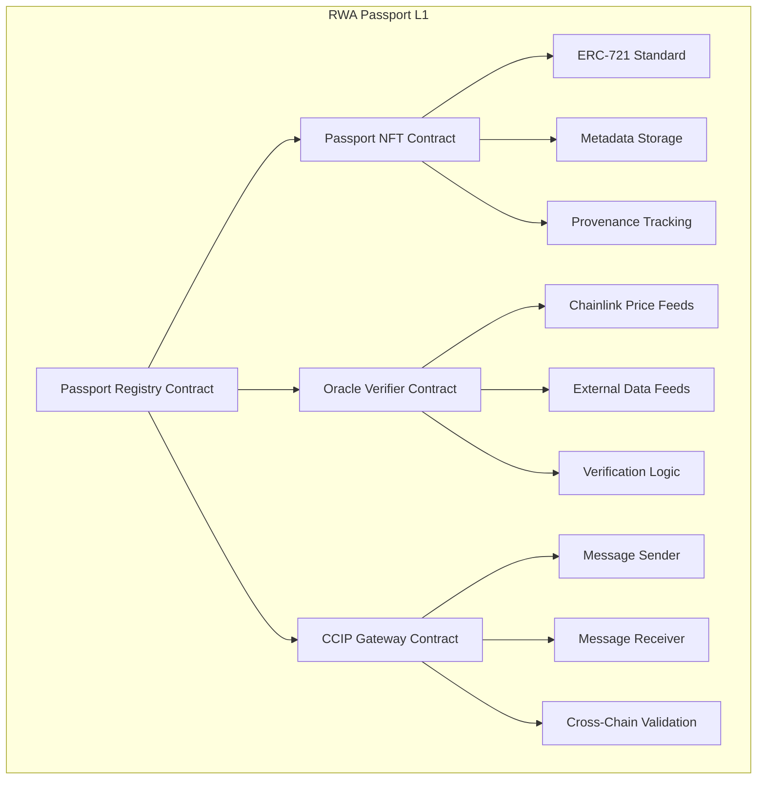
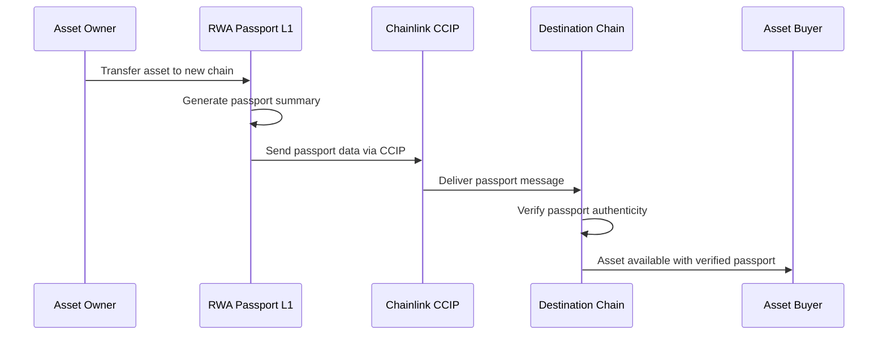
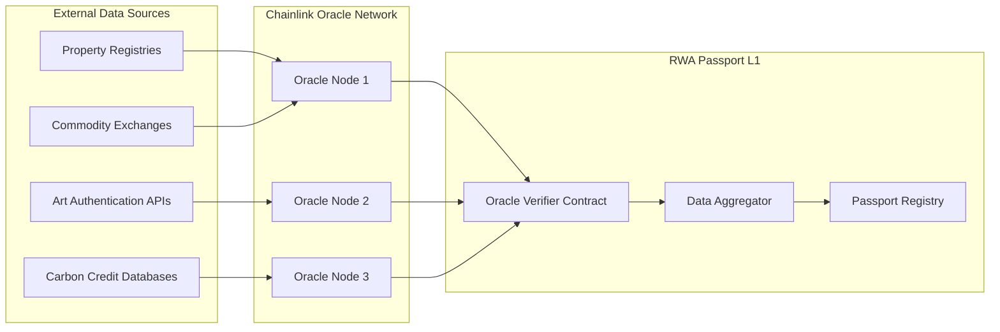
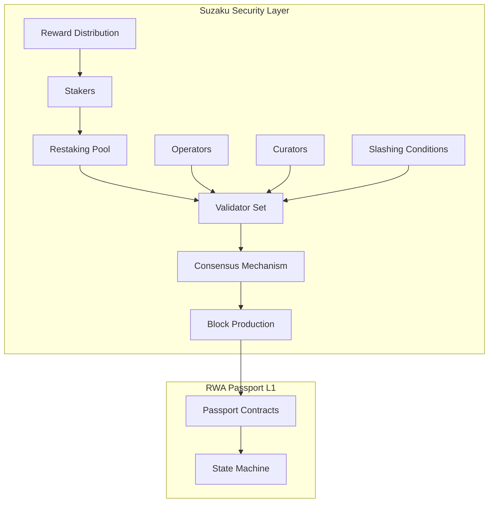
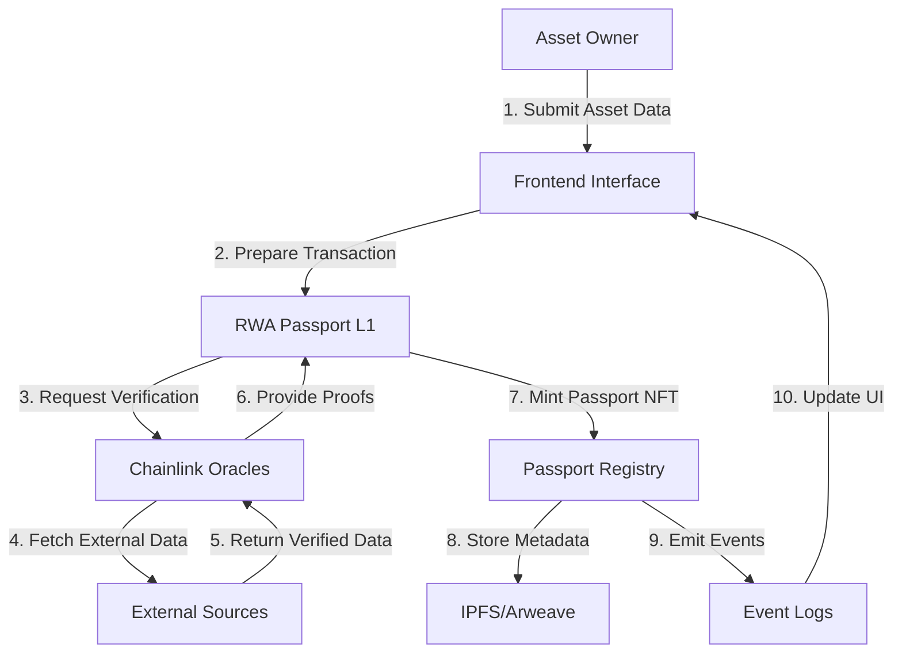
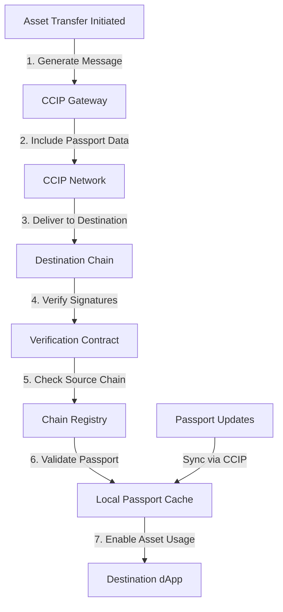
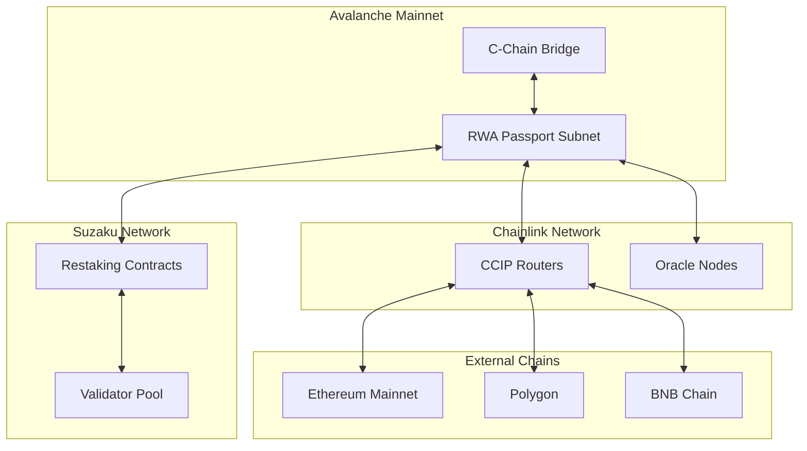

# 🏗️ Architecture Deep Dive

## System Overview

The Cross-Chain RWA Passport system is built on a **three-layer architecture**:

1. **Passport Layer**: Custom Avalanche L1 for passport management
2. **Verification Layer**: Chainlink oracles and CCIP for data integrity
3. **Security Layer**: Suzaku restaking for infrastructure protection

## 🎯 Core Components

### 1. RWA Passport L1 (Avalanche Subnet)



#### Passport Registry Contract
**Purpose**: Central registry for all RWA passports
**Key Functions**:
- `createPassport(assetData, oracleProofs)`: Mint new passport NFT
- `updatePassport(tokenId, newData, proof)`: Update passport with oracle verification
- `verifyPassport(tokenId)`: Check passport validity and authenticity
- `transferPassport(tokenId, destinationChain, recipient)`: Initiate cross-chain transfer

#### Passport NFT Contract (ERC-721)
**Purpose**: Standardized NFT implementation for passports
**Metadata Structure**:
```json
{
  "passportId": "unique-identifier",
  "assetType": "art|property|carbon_credit|commodity",
  "basicInfo": {
    "title": "Asset Title",
    "description": "Detailed description",
    "category": "Asset category"
  },
  "verificationData": {
    "attestations": ["oracle-1-signature", "oracle-2-signature"],
    "certifications": ["cert-hash-1", "cert-hash-2"],
    "lastVerified": "timestamp"
  },
  "provenance": [
    {
      "owner": "address",
      "timestamp": "timestamp",
      "transactionHash": "hash",
      "verificationLevel": "basic|enhanced|premium"
    }
  ],
  "crossChainHistory": [
    {
      "sourceChain": "avalanche",
      "destinationChain": "ethereum",
      "timestamp": "timestamp",
      "ccipMessageId": "message-id"
    }
  ]
}
```

### 2. Cross-Chain Communication (Chainlink CCIP)



#### CCIP Message Structure
```solidity
struct PassportMessage {
    uint256 passportId;
    string assetType;
    bytes32 metadataHash;
    address originalContract;
    uint256 sourceChainSelector;
    address recipient;
    VerificationProof[] proofs;
}

struct VerificationProof {
    bytes32 dataHash;
    bytes signature;
    address oracle;
    uint256 timestamp;
}
```

### 3. Oracle Integration (Chainlink)



#### Oracle Verification Flow
1. **Data Request**: Passport creation triggers oracle request
2. **Multi-Source Fetch**: Oracles fetch data from multiple sources
3. **Consensus Mechanism**: Aggregate and validate responses
4. **On-Chain Storage**: Store verified data hash on passport
5. **Continuous Updates**: Periodic re-verification for dynamic assets

### 4. Security Infrastructure (Suzaku)



## 📊 Data Flow Architecture

### Passport Creation Flow


### Cross-Chain Verification Flow


## 🔧 Technical Specifications

### Smart Contract Architecture

#### PassportRegistry.sol
```solidity
// Core registry contract managing all passports
contract PassportRegistry is Ownable, ReentrancyGuard {
    mapping(uint256 => Passport) public passports;
    mapping(bytes32 => bool) public verifiedDataHashes;
    
    struct Passport {
        uint256 id;
        string assetType;
        bytes32 metadataHash;
        address owner;
        uint256 createdAt;
        uint256 lastVerified;
        bool isActive;
    }
    
    event PassportCreated(uint256 indexed id, address indexed owner);
    event PassportVerified(uint256 indexed id, bytes32 dataHash);
    event CrossChainTransfer(uint256 indexed id, uint256 destinationChain);
}
```

#### CCIPGateway.sol
```solidity
// Handles cross-chain communication
contract CCIPGateway is CCIPReceiver, OwnerIsCreator {
    using FunctionsClient for FunctionsClient.Request;
    
    mapping(uint256 => bytes32) public passportHashes;
    mapping(bytes32 => bool) public trustedSources;
    
    function sendPassportData(
        uint256 passportId,
        uint64 destinationChain,
        address recipient
    ) external payable {
        // Implementation for sending passport via CCIP
    }
    
    function _ccipReceive(
        Client.Any2EVMMessage memory message
    ) internal override {
        // Implementation for receiving passport data
    }
}
```

### Performance Specifications

| Component | Specification | Target Performance |
|-----------|---------------|-------------------|
| **Passport Creation** | Time to mint | < 30 seconds |
| **Oracle Verification** | Response time | < 2 minutes |
| **Cross-Chain Transfer** | CCIP delivery | < 20 minutes |
| **Verification Lookup** | Query response | < 5 seconds |
| **Subnet Throughput** | TPS capacity | 4,500+ TPS |
| **Storage Efficiency** | Data per passport | < 2 KB on-chain |

### Security Considerations

#### Access Control
- **Multi-signature requirements** for passport issuance
- **Role-based permissions** for different operations
- **Time-locked upgrades** for critical contract functions

#### Data Integrity
- **Cryptographic hashes** for all metadata
- **Digital signatures** from trusted oracles
- **Merkle trees** for efficient verification

#### Cross-Chain Security
- **Message authentication** via CCIP protocols
- **Source chain validation** for incoming messages
- **Replay attack protection** through nonces

## 🌐 Network Topology

### Mainnet Deployment


### Testnet Configuration
- **Primary Testnet**: Avalanche Fuji
- **Cross-Chain Testing**: Ethereum Sepolia, Polygon Mumbai
- **Oracle Testing**: Chainlink Price Feeds (Testnet)
- **Security Testing**: Suzaku Testnet Integration

## 📈 Scalability Design

### Horizontal Scaling
- **Multiple passport subnets** for different asset types
- **Load balancing** across oracle providers
- **Distributed IPFS storage** for metadata

### Vertical Scaling
- **Optimized contract bytecode** for gas efficiency
- **Batch operations** for multiple passports
- **Lazy loading** for complex verification data

### Future Enhancements
- **Layer 2 integration** for high-frequency updates
- **Zero-knowledge proofs** for privacy-preserving verification
- **AI-powered** fraud detection and risk assessment

---

*This architecture supports the 2-day hackathon implementation while providing a roadmap for enterprise-scale deployment.* 