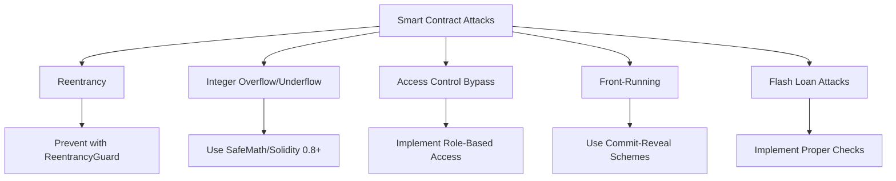
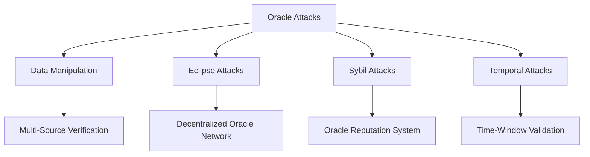
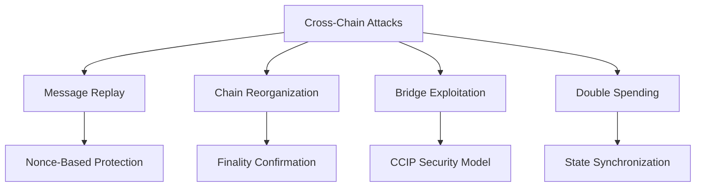
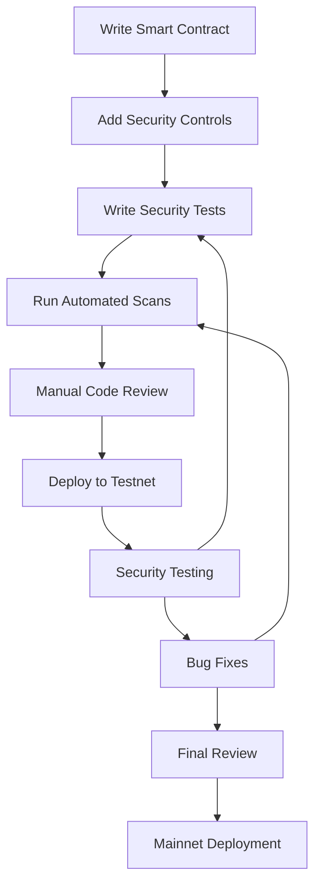

# 🔒 Security Considerations

## Overview

The Cross-Chain RWA Passport system handles valuable asset metadata and facilitates cross-chain verification, making security a critical priority. This document outlines the security model, threat analysis, and mitigation strategies implemented in the system.

## 🎯 Security Objectives

### Primary Security Goals
1. **Data Integrity**: Ensure passport metadata cannot be tampered with
2. **Authentication**: Verify the legitimacy of asset issuers and oracles
3. **Authorization**: Control access to passport operations
4. **Cross-Chain Security**: Maintain security across different blockchain networks
5. **Oracle Security**: Protect against oracle manipulation and false data
6. **Smart Contract Security**: Prevent exploitation of contract vulnerabilities

## 🚨 Threat Model

### Threat Actors

#### 1. Malicious Asset Issuers
**Capabilities**: Create fraudulent passports, manipulate metadata
**Motivation**: Financial gain through fake asset verification
**Impact**: High - undermines entire system trust

#### 2. Oracle Manipulators
**Capabilities**: Provide false verification data
**Motivation**: Manipulate asset values or verification status
**Impact**: High - corrupts verification integrity

#### 3. Cross-Chain Attackers
**Capabilities**: Intercept or modify CCIP messages
**Motivation**: Create false cross-chain asset verifications
**Impact**: High - enables cross-chain fraud

#### 4. Smart Contract Exploiters
**Capabilities**: Find and exploit contract vulnerabilities
**Motivation**: Drain funds, manipulate state
**Impact**: Critical - system compromise

#### 5. Insider Threats
**Capabilities**: Abuse admin privileges
**Motivation**: Various malicious intents
**Impact**: Critical - privileged access abuse

### Attack Vectors

#### Smart Contract Attacks


#### Oracle Attacks


#### Cross-Chain Attacks


## 🛡️ Security Controls

### 1. Smart Contract Security

#### Access Control Implementation
```solidity
// Role-based access control using OpenZeppelin
contract PassportRegistry is AccessControl {
    bytes32 public constant ISSUER_ROLE = keccak256("ISSUER_ROLE");
    bytes32 public constant ORACLE_ROLE = keccak256("ORACLE_ROLE");
    bytes32 public constant ADMIN_ROLE = keccak256("ADMIN_ROLE");
    
    modifier onlyIssuer() {
        require(hasRole(ISSUER_ROLE, msg.sender), "Not authorized issuer");
        _;
    }
    
    modifier onlyOracle() {
        require(hasRole(ORACLE_ROLE, msg.sender), "Not authorized oracle");
        _;
    }
}
```

#### Reentrancy Protection
```solidity
// Using OpenZeppelin's ReentrancyGuard
function createPassport(
    string memory assetType,
    bytes32 metadataHash,
    bytes[] memory oracleProofs
) external nonReentrant onlyIssuer returns (uint256) {
    // Safe implementation with checks-effects-interactions pattern
    require(_verifyOracleProofs(oracleProofs, metadataHash), "Invalid proofs");
    
    uint256 tokenId = _tokenIdCounter++;
    passports[tokenId] = Passport({...});
    
    _safeMint(msg.sender, tokenId);
    emit PassportCreated(tokenId, msg.sender, assetType, metadataHash);
}
```

#### Input Validation
```solidity
function updatePassport(
    uint256 tokenId,
    bytes32 newMetadataHash,
    bytes[] memory updateProofs
) external {
    require(_exists(tokenId), "Passport does not exist");
    require(newMetadataHash != bytes32(0), "Invalid metadata hash");
    require(updateProofs.length > 0, "No proofs provided");
    require(
        ownerOf(tokenId) == msg.sender || hasRole(ISSUER_ROLE, msg.sender),
        "Unauthorized update"
    );
    
    // Additional validation logic...
}
```

### 2. Oracle Security

#### Multi-Source Verification
```solidity
struct OracleResponse {
    address oracle;
    bytes32 dataHash;
    bool isValid;
    uint256 timestamp;
    bytes signature;
}

function _verifyOracleProofs(
    bytes[] memory proofs,
    bytes32 dataHash
) internal view returns (bool) {
    uint256 validResponses = 0;
    uint256 requiredResponses = 2; // Minimum 2 out of 3 oracles
    
    for (uint i = 0; i < proofs.length; i++) {
        OracleResponse memory response = abi.decode(proofs[i], (OracleResponse));
        
        if (_verifyOracleSignature(response, dataHash)) {
            validResponses++;
        }
    }
    
    return validResponses >= requiredResponses;
}
```

#### Oracle Reputation System
```solidity
struct OracleMetrics {
    uint256 totalRequests;
    uint256 successfulResponses;
    uint256 averageResponseTime;
    uint256 slashingEvents;
    bool isActive;
}

mapping(address => OracleMetrics) public oracleMetrics;

function updateOracleReputation(address oracle, bool successful) internal {
    OracleMetrics storage metrics = oracleMetrics[oracle];
    metrics.totalRequests++;
    
    if (successful) {
        metrics.successfulResponses++;
    }
    
    // Calculate reputation score
    uint256 successRate = (metrics.successfulResponses * 100) / metrics.totalRequests;
    if (successRate < 80) { // 80% minimum success rate
        _slashOracle(oracle, "Low success rate");
    }
}
```

### 3. Cross-Chain Security

#### Message Authentication
```solidity
function sendPassportData(
    uint64 destinationChainSelector,
    address receiver,
    uint256 passportId,
    PassportData memory data
) external returns (bytes32 messageId) {
    // Verify sender authorization
    require(hasRole(ISSUER_ROLE, msg.sender), "Unauthorized sender");
    
    // Create authenticated message
    bytes32 messageHash = keccak256(abi.encode(
        passportId,
        data.metadataHash,
        block.timestamp,
        block.number
    ));
    
    // Sign message with contract private key (managed securely)
    bytes memory signature = _signMessage(messageHash);
    
    PassportMessage memory message = PassportMessage({
        passportId: passportId,
        data: data,
        timestamp: block.timestamp,
        signature: signature,
        sourceChain: _getChainSelector()
    });
    
    return _sendCCIPMessage(destinationChainSelector, receiver, message);
}
```

#### Replay Attack Prevention
```solidity
mapping(bytes32 => bool) public processedMessages;

function _ccipReceive(Client.Any2EVMMessage memory any2EvmMessage) internal override {
    PassportMessage memory message = abi.decode(any2EvmMessage.data, (PassportMessage));
    
    // Generate unique message identifier
    bytes32 messageId = keccak256(abi.encode(
        message.passportId,
        message.timestamp,
        any2EvmMessage.sourceChainSelector,
        any2EvmMessage.sender
    ));
    
    // Check for replay attacks
    require(!processedMessages[messageId], "Message already processed");
    processedMessages[messageId] = true;
    
    // Verify message age (prevent old message replay)
    require(
        block.timestamp - message.timestamp <= MAX_MESSAGE_AGE,
        "Message too old"
    );
    
    // Process the message...
}
```

### 4. Suzaku Security Integration

#### Validator Security
```solidity
function _validateSuzakuSecurity() internal view returns (bool) {
    // Check minimum validator threshold
    require(
        getActiveValidatorCount() >= securityConfig.minimumValidators,
        "Insufficient validators"
    );
    
    // Check total stake threshold
    require(
        getTotalStaked() >= minimumTotalStake,
        "Insufficient total stake"
    );
    
    // Check validator distribution (prevent centralization)
    require(
        _checkValidatorDistribution(),
        "Validator centralization detected"
    );
    
    return true;
}

function _checkValidatorDistribution() internal view returns (bool) {
    // Ensure no single validator controls >33% of stake
    uint256 maxSingleStake = (getTotalStaked() * 33) / 100;
    
    // This would iterate through all validators (simplified here)
    // return maxValidatorStake <= maxSingleStake;
    return true; // Simplified for demo
}
```

#### Slashing Protection
```solidity
event SlashingProposed(
    address indexed validator,
    uint256 amount,
    string reason,
    bytes evidence
);

function proposeSlashing(
    address validator,
    uint256 amount,
    string memory reason,
    bytes memory evidence
) external onlyRole(SLASHING_ROLE) {
    require(authorizedValidators[validator], "Not a validator");
    require(amount <= getMaxSlashableAmount(validator), "Exceeds max slashable");
    
    // Store slashing proposal with timelock
    bytes32 proposalId = keccak256(abi.encode(validator, amount, reason, block.timestamp));
    slashingProposals[proposalId] = SlashingProposal({
        validator: validator,
        amount: amount,
        reason: reason,
        evidence: evidence,
        proposedAt: block.timestamp,
        executed: false
    });
    
    emit SlashingProposed(validator, amount, reason, evidence);
}
```

## 🔍 Security Testing

### Test Coverage Requirements

#### Unit Tests
- [ ] All access control modifiers
- [ ] Input validation functions
- [ ] State transition logic
- [ ] Edge cases and boundary conditions
- [ ] Error handling paths

#### Integration Tests
- [ ] Oracle verification workflows
- [ ] Cross-chain message flows
- [ ] Suzaku integration points
- [ ] End-to-end passport lifecycle

#### Security-Specific Tests
```solidity
// Example security test
function testReentrancyAttack() public {
    // Deploy malicious contract that attempts reentrancy
    MaliciousContract attacker = new MaliciousContract(passportRegistry);
    
    // Attempt attack
    vm.expectRevert("ReentrancyGuard: reentrant call");
    attacker.attemptReentrancy();
}

function testOracleManipulation() public {
    // Create fake oracle responses
    bytes[] memory fakeProofs = new bytes[](1);
    fakeProofs[0] = abi.encode(OracleResponse({
        oracle: address(0x123), // Unauthorized oracle
        dataHash: bytes32("fake"),
        isValid: true,
        timestamp: block.timestamp,
        signature: "fake_signature"
    }));
    
    // Should reject fake proofs
    vm.expectRevert("Invalid oracle proofs");
    passportRegistry.createPassport("art", bytes32("fake"), fakeProofs);
}
```

### Penetration Testing Checklist

#### Smart Contract Security
- [ ] Reentrancy vulnerabilities
- [ ] Integer overflow/underflow
- [ ] Access control bypass
- [ ] Front-running attacks
- [ ] Gas griefing attacks
- [ ] Storage collision issues

#### Oracle Security
- [ ] Data source manipulation
- [ ] Oracle collusion scenarios
- [ ] Eclipse attack resistance
- [ ] Temporal attack prevention
- [ ] Price feed manipulation

#### Cross-Chain Security
- [ ] Message replay attacks
- [ ] Chain reorganization handling
- [ ] Bridge security verification
- [ ] Cross-chain state consistency

## 🚨 Incident Response

### Security Incident Classification

#### Severity Levels
| Level | Description | Response Time | Example |
|-------|-------------|---------------|---------|
| **Critical** | System compromise, fund loss | < 1 hour | Private key exposure |
| **High** | Major functionality affected | < 4 hours | Oracle manipulation |
| **Medium** | Limited impact, workaround available | < 24 hours | API endpoint down |
| **Low** | Minor issue, no immediate impact | < 72 hours | UI display bug |

### Emergency Procedures

#### Circuit Breaker Implementation
```solidity
contract EmergencyControls is Ownable {
    bool public emergencyPaused = false;
    mapping(bytes4 => bool) public functionPaused;
    
    modifier notPaused() {
        require(!emergencyPaused, "System paused");
        require(!functionPaused[msg.sig], "Function paused");
        _;
    }
    
    function emergencyPause() external onlyOwner {
        emergencyPaused = true;
        emit EmergencyPause(msg.sender, block.timestamp);
    }
    
    function pauseFunction(bytes4 functionSelector) external onlyOwner {
        functionPaused[functionSelector] = true;
        emit FunctionPaused(functionSelector, msg.sender);
    }
}
```

#### Upgrade Procedures
```solidity
contract UpgradeablePassportRegistry is UUPSUpgradeable, OwnableUpgradeable {
    uint256 public constant UPGRADE_DELAY = 48 hours;
    
    mapping(bytes32 => uint256) public upgradeProposals;
    
    function proposeUpgrade(address newImplementation) external onlyOwner {
        bytes32 proposalId = keccak256(abi.encode(newImplementation));
        upgradeProposals[proposalId] = block.timestamp + UPGRADE_DELAY;
        
        emit UpgradeProposed(newImplementation, upgradeProposals[proposalId]);
    }
    
    function executeUpgrade(address newImplementation) external onlyOwner {
        bytes32 proposalId = keccak256(abi.encode(newImplementation));
        require(
            upgradeProposals[proposalId] != 0 && 
            block.timestamp >= upgradeProposals[proposalId],
            "Upgrade not ready"
        );
        
        _upgradeTo(newImplementation);
        delete upgradeProposals[proposalId];
    }
}
```

## 📋 Security Audit Checklist

### Pre-Deployment Security Review

#### Smart Contract Security
- [ ] Code review by multiple developers
- [ ] Automated security scanning (Mythril, Slither)
- [ ] Unit test coverage >95%
- [ ] Integration test coverage >90%
- [ ] Gas optimization review
- [ ] Access control verification

#### Oracle Security
- [ ] Oracle source verification
- [ ] Multi-source validation testing
- [ ] Reputation system validation
- [ ] Response time monitoring setup
- [ ] Fallback mechanism testing

#### Cross-Chain Security
- [ ] CCIP integration testing
- [ ] Message validation verification
- [ ] Chain selector validation
- [ ] Fee calculation accuracy
- [ ] Error handling completeness

#### Suzaku Integration Security
- [ ] Validator onboarding security
- [ ] Staking mechanism review
- [ ] Slashing condition validation
- [ ] Reward distribution fairness
- [ ] Emergency pause functionality

### Post-Deployment Monitoring

#### Real-Time Monitoring
```typescript
interface SecurityMonitoring {
  // Contract state monitoring
  monitorUnusualTransactions(): void;
  trackGasUsageAnomalies(): void;
  detectAccessControlViolations(): void;
  
  // Oracle monitoring
  monitorOracleResponseTimes(): void;
  detectOracleDeviations(): void;
  trackOracleReputation(): void;
  
  // Cross-chain monitoring
  monitorCCIPMessageDelivery(): void;
  trackCrossChainFailures(): void;
  detectUnusualMessagePatterns(): void;
}
```

#### Alert Configuration
```yaml
security_alerts:
  critical:
    - large_fund_movements: >$100,000
    - admin_function_calls: any
    - contract_upgrades: any
    - oracle_consensus_failures: >50%
  
  high:
    - unusual_transaction_volume: >200% of daily average
    - oracle_response_delays: >5 minutes
    - ccip_message_failures: >10%
    - validator_stake_changes: >20%
  
  medium:
    - gas_price_anomalies: >300% of average
    - oracle_reputation_drops: <80%
    - cross_chain_delays: >1 hour
```

## 🔐 Best Practices for Hackathon Implementation

### Quick Security Wins
1. **Use OpenZeppelin Contracts**: Leverage battle-tested security patterns
2. **Implement Access Control**: Use role-based permissions from day one
3. **Add Input Validation**: Validate all user inputs and external data
4. **Enable Reentrancy Guards**: Protect against reentrancy attacks
5. **Use Time Locks**: Implement delays for critical operations

### Common Pitfalls to Avoid
1. **Hardcoded Values**: Avoid hardcoding addresses or sensitive data
2. **Insufficient Testing**: Don't skip security-focused tests
3. **Oracle Trust**: Don't trust single oracle sources
4. **Admin Overreach**: Limit admin powers and use multi-sig
5. **Gas Optimization Over Security**: Security first, optimization second

### Security-First Development Workflow


---

**Remember**: Security is not a feature to be added later—it must be built into the foundation of the system from the very beginning. During the hackathon, prioritize getting these security fundamentals right over adding complex features. A secure, simple system is far more valuable than a complex, vulnerable one. 🛡️ 